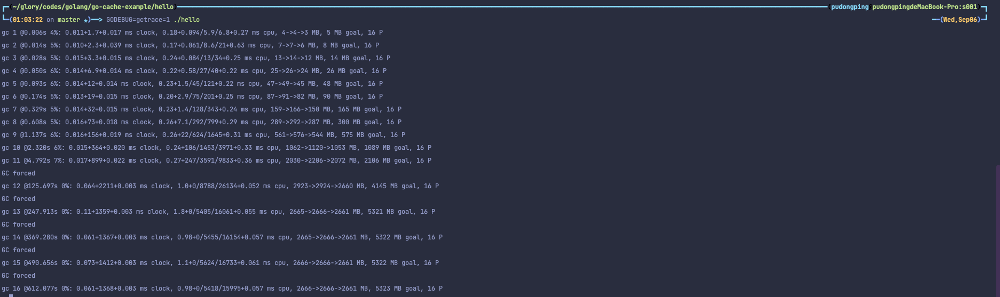

# go-cache-example

进程内缓存示例。

## 常用的缓存淘汰算法

### 1. [FIFO（First In First Out）](./fifo)：先进先出。

FIFO，先进先出，也就是淘汰缓存中最早添加的记录。在 FIFO Cache 设计中，核心原则就是：如果一个数据最先进入缓存，那么也应该最早淘汰掉。这么认为的根据是，最早添加的记录，其不再被使用的可能性比刚添加的可能性大。
这种算法的实现非常简单，创建一个队列（一般通过双向链表实现），新增记录添加到队尾，缓存满了，淘汰队首。

### 2. [LFU（Least Frequently Used）](./lfu)：最不经常使用。

LFU，即最少使用，也就是淘汰缓存中访问频率最低的记录。LFU 认为，如果数据过去被访问多次，那么将来被访问的频率也更高。LFU 的实现需要维护一个按照访问次数排序的队列，每次访问，访问次数加 1，队列重新排序，淘汰时选择访问次数最少的即可。

### 3. [LRU（Least Recently Used）](./lru)：最近最少使用。

LRU，即最近最少使用，相对于仅考虑时间因素的 FIFO 和仅考虑访问频率的 LFU，LRU 算法可以认为是相对平衡的一种淘汰算法。LRU 认为，如果数据最近被访问过，那么将来被访问的概率也会更高。
LRU 算法的实现非常简单，维护一个队列，如果某条记录被访问了，则移动到队尾，那么队首则是最近最少访问的数据，淘汰该条记录即可。因此该算法的核心数据结构和 FIFO 是一样的，只是记录的移动方式不同而已。

***LRU 是缓存淘汰算法中最常使用的算法，groupcache 库使用的就是 LRU 算法***。

## [并发安全的进程内缓存](./tour_cache.go)

提供了并发安全的使用以上三种缓存淘汰算法（FIFO、LFU、LRU）的接口。

使用方式可见 [tour_cache_test.go](./tour_cache_test.go)

## [引入类似 BigCache 中的分片技术实现的 LRU 算法](./fast)

- Hash 算法（FNV-1A Hash 算法）的实现直接使用的 BigCache 中的默认实现。[详见](./fast/hasher.go)
- 单个分片的实现。[详见](./fast/shard.go)
- cache 的实现。[详见](./fast/cache.go)

### GC 耗时验证

先编译如下代码

```go
// hello.go
package main

import (
	"strconv"
	"time"

	"github.com/pudongping/go-cache-example/fast"
)

type T struct {
	H, I, J, K, L, M, N int
}

type Value struct {
	A string
	B int
	C time.Time
	D []byte
	E float32
	F *string
	T T
}

func main() {
	cache := fast.NewFastCache(0, 1024, nil)

	for i := 0; i < 10000000; i++ {
		cache.Set(strconv.Itoa(i), &Value{})
	}

	for i := 0; ; i++ {
		cache.Del(strconv.Itoa(i))
		cache.Set(strconv.Itoa(10000000+i), &Value{})
		time.Sleep(5 * time.Millisecond)
	}
}
```

编译后运行

```bash
GODEBUG=gctrace=1 ./hello
```

设置 `gctrace=1` 会使垃圾收集器向 stderr 发出每一次 GC 的相关信息，汇总收集的内存量和暂停的时长。



| 占位符 | 说明                    |
| --- |-----------------------|
| gc # | GC 编号，每次 GC 递增        |
| @#s | 自程序启动以来的时间（以秒为单位）     |
| #% | 自程序启动以来在 GC 中花费的时间百分比 |
| #+...+# | GC 阶段的 时钟/CPU 时间      |
| #->#-># MB | GC 开始、GC 结束和活动堆的堆大小   |
| # MB goal  | 目标堆大小                 |
| # P | 使用的处理器数量              |